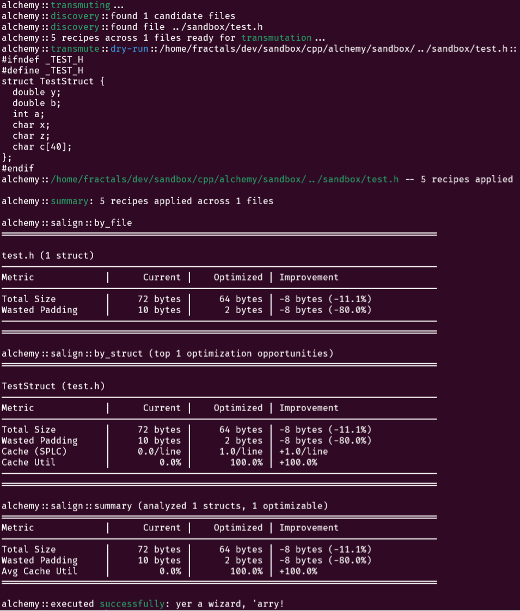

# `alchemy`: command-line refactoring tool

[](https://cppreference.com/w/cpp/compiler_support/20.html)
[](https://llvm.org/)
[](https://github.com/turakz/alchemy)
[](https://github.com/turakz/alchemy)

**version**: v1.0.0-alpha - struct alignment refactoring, cross-compiler support

## supported platforms & compilers
- **platforms**: Linux, Windows (macOS supported)
- **languages**: C, C++
- **compilers**: GCC, Clang, MSVC, IAR (embedded ARM)

## why `alchemy`?

performance and efficiency:
- **memory footprint**: memory constrained systems cannot afford to waste bytes
- **cache usage**: better alignment, better cache locality -> better performance

## features

### refactoring
- c/cxx struct alignment optimizations (`--salign`)
- **cross-compiler support**: works with GCC, Clang, MSVC, and IAR projects

### metrics
- struct alignment: total size, wasted padding, average cache utilization, structs per cache line (SPCL)

### dry-runs
- where applicable, will redirect transmutations to `stdout`

## quick start

```bash
git clone https://github.com/turakz/alchemy.git
cd alchemy
make setup            # install dependencies (llvm-18, clang, cmake, ninja, fmt)
make alchemy.release  # or: make alchemy.debug
```

the binary is written to `build/alchemy`.

### environment check

```bash
make doctor  # verify your environment before building
```

## running tests

```bash
make test.unit          # run unit tests (192 tests)
make test.integration   # run integration tests (33 tests)
make test.all           # run all tests (unit + integration)
make test.performance   # run performance benchmarks
```

## formatting & linting
```bash
make format       # format source code with clang-format
make format.check # check formatting without modifying files
make lint         # run clang-tidy linter
make check        # run both format.check + lint
```

## coverage

analyze code coverage to see which lines, functions, and branches are exercised by tests.

### setup (one-time)
```bash
make setup.coverage  # installs lcov + compiler-rt
```

### generate reports
```bash
make coverage              # full coverage (all tests)
make coverage.unit         # unit tests only
make coverage.integration  # integration tests only
```

### view results
open `build/coverage_html/index.html` in your browser.

### cleanup
```bash
make clean           # remove build artifacts
make coverage.clean  # remove coverage artifacts
```

## uninstalling dependencies

```bash
make teardown           # remove dependencies installed by 'make setup'
make teardown.coverage  # remove coverage tools installed by 'make setup.coverage'
```

note: see `make help` for the full list of targets and descriptions


## usage

`alchemy` is built with the command-line (cli) in mind (plus a dash of minimalism). if you are familiar with any `clang`, `gcc` family tool-chains, some
of this should come as no surprise to you. however, to use `alchemy`, you must first build your project and produce a build directory (with `compile_commands.json`),
or tell `alchemy` where to find one.

- `alchemy` will auto-detect build dirs starting from the executing directory (current working dir),
so it is possible it finds the wrong one. when in doubt, be explicit.


```bash
# actual usage under --help
alchemy [options] <source0> [... sourceN]
```

```bash
alchemy --help
```
## examples


```bash
alchemy -salign "inc/**/*.h"
alchemy -salign "inc/**/*.hpp"

alchemy -salign "inc/*.h"
alchemy -salign "inc/*.hpp"

alchemy -salign "inc/sensor.h" "inc/memory.h"
alchemy -salign "inc/sensor.hpp" "inc/memory.hpp"

alchemy -salign "inc/**/*.h" -dry-run # redirect transmutations to stdout
alchemy -salign "inc/**/*.hpp" -dry-run

alchemy -salign "inc/**/*.h" -exclude="inc/external/**/*.h" -dry-run # do not transmute excluded files
alchemy -salign "inc/**/*.h" -exclude="inc/external/**/*.hpp" -dry-run
```

- `-b` lets you specify build directories:

```bash
alchemy -b "project/build" -salign "inc/**/*.h" -exclude="inc/external/**/*.h" -dry-run

# or pass one to LLVM's parser (if applicable) `-p`
alchemy -p "project/build" -salign "inc/**/*.h" -exclude="inc/external/**/*.h" -dry-run
```

### multi-threading

```bash
alchemy -salign "inc/**/*.h" -j4  # use 4 cores
alchemy -salign "inc/**/*.h" -j0  # auto-detect based on CPU cores (default: 1)
```

### specifying LLVM version

by default, alchemy auto-detects the highest installed LLVM version. if you have multiple LLVM installations and need to use a specific version, you can override this:

```bash
# via CMake variable
cmake -S . -B build -DALCHEMY_LLVM_VERSION=18 -DCMAKE_TOOLCHAIN_FILE=cmake/toolchains/clang.cmake

# via environment variable
export ALCHEMY_LLVM_VERSION=18
make alchemy.debug
```

this ensures the toolchain uses the specified version for `clang`, `clang++`, `llvm-config`, and `find_package(LLVM)`.

## example input/output

### input (72 bytes, 10 bytes wasted)

```c
#ifndef _TEST_H
#define _TEST_H
struct TestStruct {
  char x;      // 1 byte + 7 padding
  double y;    // 8 bytes
  char z;      // 1 byte + 3 padding
  int a;       // 4 bytes
  double b;    // 8 bytes
  char c[40];  // 40 bytes + 2 trailing padding
};
#endif
```

### output (64 bytes, 2 bytes wasted - 33% smaller!)


## documentation

for architecture details, see:
- `docs/design/component-diagrams.md` - architecture overview
- `docs/design/sequence-diagrams.md` - interaction flows

## license

see LICENSE file for details
