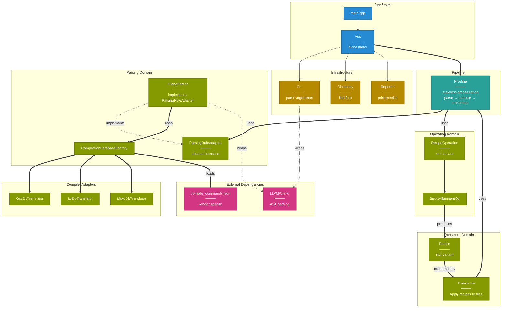
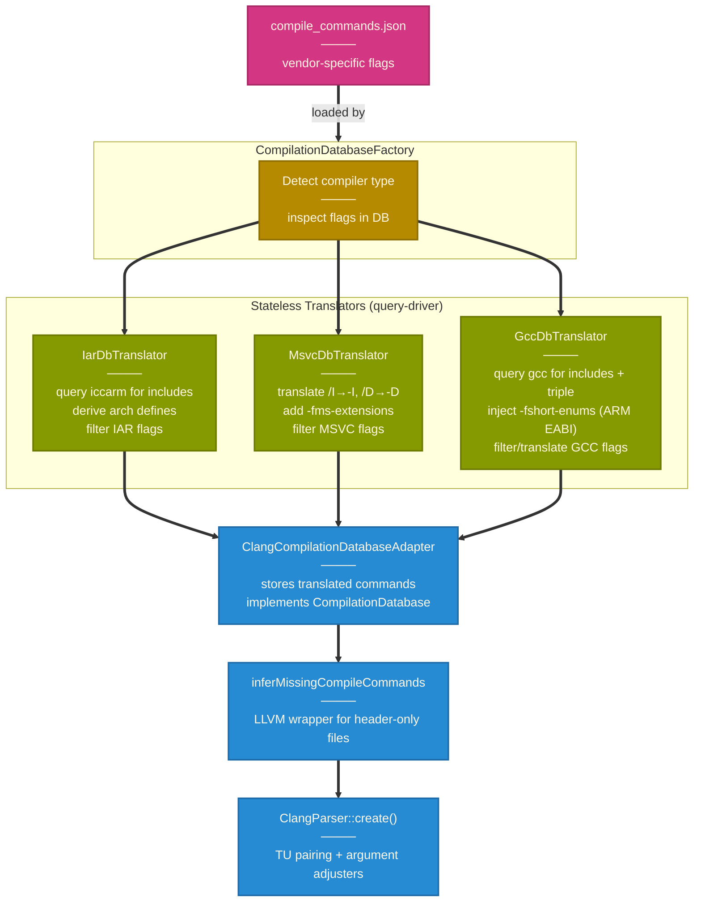

# Alchemy Component Architecture (v0.1.0-alpha)

Architecture showing module boundaries, dependency direction, and layer separation.

**Current state (v0.1.0-alpha)**:
- Single feature: struct alignment refactoring (`--salign`)
- Cross-compiler support: GCC, Clang, MSVC, IAR (query-driver approach)
- Test coverage: 276 unit + 39 integration = 315 tests (all passing)

## High-Level Module Boundaries

Shows architectural layers, module groupings, and dependency direction (top → bottom).

## Compiler Adapter Detail

Zoomed-in view of the compiler adapter and translation

**Relationship Types:**
- **Thick arrows (`==>`)** — Runtime dependencies, data flow
- **Dotted arrows (`-.->`)** — Compile-time dependencies (interface implementation, wrapping)
- **Regular arrows (`-->`)** — Structural relationships

---

See [sequence-diagrams.md](sequence-diagrams.md) for runtime execution flows.
