# Alchemy Component Architecture (v1.0.0-alpha)

High-level architecture showing components, interfaces, and dependencies.

**Current state (v1.0.0-alpha)**:
- Single feature: struct alignment refactoring (`--salign`)
- Operations use duck-typed interface: `getRequirements()`, `getName()`, `execute()`
- `std::variant` + `std::visit` provides static polymorphism without inheritance
- Cross-compiler support: GCC, Clang, MSVC, IAR (query-driver approach)
- Test coverage: 85.0% unit / 89.1% integration lines (192 unit + 33 integration = 225 tests)

## System Overview

Architecture diagram showing structure, dependencies, and flow.

```mermaid
graph TB
      %% ============================================================================
      %% LAYER 1: APPLICATION ENTRY & ORCHESTRATION
      %% ============================================================================
      subgraph Layer1[" "]
          main["main.cpp<br/>────<br/>entry point"]
          App["App"]
      end

      %% ============================================================================
      %% LAYER 2: INFRASTRUCTURE & PIPELINE (CLI -> Discovery -> Pipeline -> Reporter)
      %% ============================================================================
      subgraph Layer2[" "]
          direction LR

          CLI["CLI<br/>────<br/>parse arguments"]
          Discovery["Discovery<br/>────<br/>find files"]
          Pipeline["Pipeline<br/>────<br/>workflow coordinator"]
          Reporter["Reporter<br/>────<br/>print metrics"]
      end

      %% ============================================================================
      %% LAYER 3: DOMAIN LOGIC (LLVM/CompDB on left, Parser/Operations on right)
      %% ============================================================================
      subgraph Layer3[" "]
          %% Left side: LLVM and Compiler Adapters
          LLVM["LLVM/Clang"]
          CompDB["compile_commands.json<br/>────<br/>vendor-specific"]
          CompDBFactory["CompilationDatabaseFactory<br/>────<br/>detects compiler"]
          IARTranslator["IARDbTranslator<br/>────<br/>translates IAR commands"]
          MSVCTranslator["MSVCDbTranslator<br/>────<br/>translates MSVC commands"]
          ClangAdapter["ClangCompilationDatabaseAdapter<br/>────<br/>stores translated commands"]

          CompDBFactory ==> IARTranslator
          CompDBFactory ==> MSVCTranslator
          IARTranslator ==> ClangAdapter
          MSVCTranslator ==> ClangAdapter

          %% Right side: Parsing components
          ParserIface["ParsingRuleAdapter<br/>────<br/>interface"]
          ParserIface --> ParserSpacer[" "]
          style ParserSpacer fill:none,stroke:none
          ParserSpacer --> ClangParser["ClangParser<br/>────<br/>concrete implementation"]

          %% Operations components
          OpVariant["RecipeOperation<br/>────<br/>std::variant"]
          StructAlign["StructAlignmentOp"]

          %% Recipe Type components
          RecipeVariant["Recipe<br/>────<br/>std::variant"]
          RefactorRecipe -.-> RecipeVariant

          %% Transmutation component
          Transmute["Transmute<br/>────<br/>applies recipes to files"]
      end

      %% ============================================================================
      %% VERTICAL DEPENDENCIES (layer by layer)
      %% ============================================================================
      main --> App

      %% App uses infrastructure (sequential flow)
      App --> CLI
      App --> Discovery
      App --> Pipeline
      App --> Reporter

      %% Pipeline uses domain logic (thick arrows for primary flow)
      Pipeline ==>|uses| ParserIface
      Pipeline ==>|uses| OpVariant
      Pipeline ==>|uses| Transmute

      %% ClangParser implements interface (dotted = compile-time)
      ClangParser -.->|implements| ParserIface

      %% ClangParser uses factory (thick arrow = runtime dependency)
      ClangParser ==>|uses| CompDBFactory

      %% ClangAdapter implements CompilationDatabase interface from LLVM
      ClangAdapter ==>|implements| LLVM

      %% Factory reads compilation database (thick arrow = data flow)
      CompDB ==>|loaded by| CompDBFactory

      %% Operations are variant alternatives
      OpVariant ==> StructAlign

      %% Operations produce recipes (thick arrows = data flow)
      StructAlign ==>|produces| RefactorRecipe

      %% Transmute consumes recipes (thick arrows = data flow)
      RefactorRecipe ==>|consumed by| Transmute

      %% Wraps LLVM (dotted = compile-time dependency)
      ClangParser -.->|wraps| LLVM
      CLI -.->|wraps| LLVM

      %% ============================================================================
      %% STYLING
      %% ============================================================================
      classDef layer1 fill:#268bd2,stroke:#1e6ba8,stroke-width:2px,color:#fdf6e3
      classDef layer2infra fill:#b58900,stroke:#8f6d00,stroke-width:2px,color:#fdf6e3
      classDef layer2pipe fill:#2aa198,stroke:#208c84,stroke-width:2px,color:#fdf6e3
      classDef layer3 fill:#859900,stroke:#6c7a00,stroke-width:3px,color:#fdf6e3
      classDef layer4 fill:#d33682,stroke:#a92866,stroke-width:3px,color:#fdf6e3
      classDef container fill:#002b36,stroke:#586e75,stroke-width:1px

      class main,App layer1
      class CLI,Discovery,Reporter layer2infra
      class Pipeline layer2pipe
      class ParserIface,ClangParser,CompDBFactory,IARTranslator,MSVCTranslator,ClangAdapter,OpVariant,StructAlign,RecipeVariant,RefactorRecipe,Transmute layer3
      class LLVM,CompDB layer4
      class Layer1,Layer2,Layer3 container
```



**Color Legend:**
- **Blue** - Application Layer (main, App)
- **Orange** - Infrastructure Services (CLI, Discovery, Reporter)
- **Cyan** - Pipeline Coordination (Pipeline - template-based)
- **Green** - Domain Logic (Parser, Compiler Adapters, Operations, Recipes, Transmute)
- **Magenta** - External Dependencies (LLVM/Clang, compile_commands.json)

**Relationship Types:**
- **Thick arrows (`==>`)** - Runtime dependencies, data flow, primary execution path
- **Dotted arrows (`-.->`)** - Compile-time dependencies (inheritance, implementation, wrapping)
- **Regular arrows (`→`)** - Standard structural relationships, sequential flow

---

## Core Components

### 1. App (Application Orchestrator)
**Location**: `inc/app/app.hpp`, `src/app/app.cpp`

Entry point that coordinates the entire workflow.

```cpp
class App {
  static Result<App> createFromCli(int argc, const char** argv);
  static Result<App> create(ParsedOptions options);
  int exec();
};
```

**Responsibilities**:
- Parse CLI → discover files → create parser → setup operations
- Delegate to `pipeline::execute()`
- Report metrics and return exit code

---

### 2. Pipeline (Template-Based Stateless Orchestration)
**Location**: `inc/pipeline/pipeline.hpp`, `src/pipeline/pipeline.cpp`, `inc/pipeline/preflight_validator.hpp`

Pure functions coordinating: parse → execute → transmute.

```cpp
struct TransmutationSummary {
  size_t recipesApplied;
  size_t filesProcessed;
};

struct PipelineResult {
  vector<Metrics> allMetrics;
  TransmutationSummary summary;
};

// template-based for dependency injection
template<typename RecipeOperationVariantT>
Result<PipelineResult> execute(
  ParsingRuleAdapter& parser,
  const vector<RecipeOperationVariantT>& operations,  // generic over variant type
  const path& buildDir,
  bool dryRun
);
```

**Key Template Functions** (in `inc/pipeline/pipeline.hpp`):
- `detail::gatherRequirements<RecipeOperationVariantT>()` - Aggregate parsing requirements
- `runParser<RecipeOperationVariantT>()` - Execute parser with aggregated requirements
- `executeOperations<RecipeOperationVariantT>()` - Run all operations on artifacts
- `execute<RecipeOperationVariantT>()` - Full pipeline orchestration

**Flow**:
1. Gather parsing requirements from all operations (uses `std::visit` to call `getRequirements()`)
2. Parse once, return `parser::artifacts::ParseResults`
3. Execute all operations on parsed artifacts (uses `std::visit` to call `execute()`)
4. For each operation result:
   - `transmute()` - public API that orchestrates transmutation
   - `validateTransmute()` - pre-flight validation of all target files
   - `executeTransmute()` - apply recipes (file-by-file transmutation)
5. Return `PipelineResult` with metrics and summary

**Key**:
- **Template-based** - enables testing with mock operations
- Stateless data transformation (no I/O, no state)
- Single parse pass via requirement aggregation
- Artifacts passed by const reference to operations (no copying)
- Fail-fast error handling
- Pre-flight validation prevents partial modifications

**Testability**:
- Production: `execute<RecipeOperation>(parser, operations, ...)`
- Testing: `execute<TestRecipeOperation>(mockParser, mockOperations, ...)`

---

### 3. Parser (Language-Agnostic Interface)
**Location**: `inc/parsing/parser.hpp`, `inc/parsing/libclang/clang_parser.hpp`

Adapter pattern enabling multi-language support.

```cpp
class ParsingRuleAdapter {
  virtual Result<ParseResults> parse(const ParsingRequirements& requirements) = 0;
  virtual string_view getName() const = 0;
};

class ClangParser : public ParsingRuleAdapter {
  static Result<unique_ptr<ClangParser>>
    create(const vector<path>& sourceFiles, const path& buildDir);
  Result<ParseResults> parse(const ParsingRequirements& requirements) override;
  string_view getName() const override;  // returns compiler type
private:
  unique_ptr<ClangTool> m_tool;
  unique_ptr<CompilationDatabase> m_compilationDb;
  string m_compilerType;  // "IAR", "MSVC", "GCC/Clang"
};
```

**Key**:
- Operations never see ClangTool - only language-agnostic `parser::artifacts::ParseResults`
- `buildDir` passed to Clang via `-p` flag (for finding `compile_commands.json`)
- If `buildDir` empty, Clang auto-detects from CWD and parent directories
- Uses `CompilationDatabaseFactory` to detect and adapt vendor-specific compilation databases (IAR, MSVC)
- Stores compiler type from factory, accessible via `getName()` (useful for debugging/testing)

---

### 3a. Compiler Adapters (Cross-Compiler Support)
**Location**: `inc/parsing/libclang/compiler_adapters/`, `src/parsing/libclang/compiler_adapters/`

Factory + Adapter pattern for vendor-specific compilation database support.

Translates vendor-specific compiler flags (IAR, MSVC) to Clang-compatible flags, enabling cross-compiler code analysis.

**Disclaimer**: Translation is for **AST parsing only**, not compilation. Translated flags enable Clang to parse the AST correctly, not to produce a valid binary.

```cpp
// Factory pattern - detects compiler and creates database
struct CompilationDatabaseInfo {
  unique_ptr<CompilationDatabase> database;  // wrapped with inference
  string compilerType;                        // "IAR", "MSVC", "GCC/Clang"
};

class CompilationDatabaseFactory {
  static Result<CompilationDatabaseInfo>
    fromBuildDir(const path& buildDir);
};

// Storage adapter - holds translated commands
class ClangCompilationDatabaseAdapter : public CompilationDatabase {
  ClangCompilationDatabaseAdapter(vector<CompileCommand> commands);
  vector<CompileCommand> getCompileCommands(StringRef filePath) const override;
  vector<CompileCommand> getAllCompileCommands() const override;
  vector<string> getAllFiles() const override;
private:
  vector<CompileCommand> m_allCommands;
  unordered_map<string, vector<CompileCommand>> m_commandsByFile;
};

// Stateless translators (query-driver approach)
class IARDbTranslator {
  CompileCommand translateCommand(const CompileCommand& iarCmd) const;
  vector<CompileCommand> translateAll(const CompilationDatabase& db) const;
  static bool isIARCompiler(const CompilationDatabase& db);
  static const unordered_set<string>& knownCompilerFlags();

  // Query-driver approach
  static Result<IARQueryConfig> extractQueryConfig(const CompilationDatabase& db);
  static Result<vector<string>> querySystemIncludes(const IARQueryConfig& query);
};

class MSVCDbTranslator {
  CompileCommand translateCommand(const CompileCommand& msvcCmd) const;
  vector<CompileCommand> translateAll(const CompilationDatabase& db) const;
  static bool isMSVCCompiler(const CompilationDatabase& db);
  static const unordered_set<string>& knownCompilerFlags();
};
```

**Architecture**:
```
compile_commands.json (vendor-specific)
    ↓
CompilationDatabaseFactory::fromBuildDir()
    ↓
    ├─ Detects IAR → IARDbTranslator
    │                   ├─ Extract compiler path + arch flags from DB
    │                   ├─ Query compiler: exec `iccarm -E -xc -v /dev/null`
    │                   ├─ Parse system include paths from compiler output
    │                   ├─ Derive architecture defines (M0/M1/M3/M4/M7/M23/M33)
    │                   ├─ Filter IAR-specific flags (--cpu, --diag_suppress, ...)
    │                   ├─ Add queried includes + compatibility defines
    │                   ├─ Translate to Clang (-target arm-none-eabi)
    │                   └─ Returns vector<CompileCommand>
    │
    ├─ Detects MSVC → MSVCDbTranslator
    │                   ├─ Filter MSVC-specific flags (/MD, /GL, /EH, ...)
    │                   ├─ Translate syntax (/I → -I, /D → -D, /std: → -std=)
    │                   ├─ Add compatibility flags (-fms-extensions)
    │                   └─ Returns vector<CompileCommand>
    │
    └─ GCC/Clang → Extract commands directly (no translation needed)
    ↓
ClangCompilationDatabaseAdapter (stores translated commands)
    ↓
inferMissingCompileCommands() (wraps adapter for header inference)
    ↓
ClangTool (receives Clang-compatible commands with header support)
```

**IAR Translation Example** - Query-driver approach queries actual compiler:
```cpp
// Input (IAR)
"iccarm --cpu=Cortex-M4 --fpu=VFPv4_sp --diag_suppress=Pa050 -I inc -D DEBUG main.c"

// Step 1: Query compiler for system includes
exec: iccarm -E -xc -v --cpu=Cortex-M4 /dev/null
output: #include <...> search starts here:
        /opt/iar/arm/inc/c
        /opt/iar/arm/inc/c/aarch32
        /opt/iar/arm/CMSIS/Core/Include
        End of search list.

// Step 2: Derive architecture defines from --cpu=Cortex-M4
arch_defines: -D__ARM7EM__=1 -D__CORE__=__ARM7EM__

// Output (Clang) - uses REAL include paths from compiler query
"clang -isystem /opt/iar/arm/inc/c \
        -isystem /opt/iar/arm/inc/c/aarch32 \
        -isystem /opt/iar/arm/CMSIS/Core/Include \
        -D__IAR_SYSTEMS_ICC__=1 -D__ICCARM__=1 \
        -D__ARM7EM__=1 -D__CORE__=__ARM7EM__ \
        -D__intrinsic= -D__packed=__attribute__((packed)) \
        -I inc -D DEBUG main.c \
        -target arm-none-eabi -Wno-everything -fsyntax-only"
```

**MSVC Translation Example** (simplified - actual translation includes additional flags):
```cpp
// Input (MSVC)
"cl.exe /Iinc /DDEBUG /std:c++17 /EHsc /W4 main.cpp"

// Output (Clang) - critical flags for correct struct layout parsing
"clang -fms-extensions -fms-compatibility -target x86_64-pc-windows-msvc \
        -I inc -D DEBUG -std=c++17 main.cpp \
        -Wno-everything -fsyntax-only"
```

**Key Components**:

1. **CompilationDatabaseFactory** -- Loads `compile_commands.json`, detects compiler via flag inspection, delegates to translator, wraps result with `inferMissingCompileCommands()` for header support.

2. **ClangCompilationDatabaseAdapter** -- Simple storage adapter implementing the `CompilationDatabase` interface over a vector of translated commands.

3. **IARDbTranslator** -- Query-driver approach: queries actual IAR compiler (`iccarm -E -xc -v`) for system include paths, derives architecture defines from `--cpu` flag (exact match: M0→ARMv6-M, M3→ARMv7-M, M4→ARMv7E-M, M33→ARMv8-M), adds compatibility defines (`__intrinsic=`, `__packed=__attribute__((packed))`), filters IAR-specific flags, targets `arm-none-eabi`.

4. **MSVCDbTranslator** -- Translates MSVC flag syntax (`/I`→`-I`, `/D`→`-D`, `/std:`→`-std=`, `/TC`→`-x c`), filters MSVC-specific flags, adds `-fms-extensions -fms-compatibility`, targets `x86_64-pc-windows-msvc`.

See `docs/design/compiler_translation.md` for detailed translation rules.

---

### 3b. CLI (Command-Line Interface)
**Location**: `inc/cli/cli.hpp`, `src/cli/cli.cpp`

Parses and validates command-line arguments.

```cpp
Result<ParsedOptions> parseCli(int argc, const char** argv);

class Validator {
  static Result<ParsedOptions> validate(CliInputs&& inputs);
};
```

**Key**:
- LLVM command-line parser integration
- Feature-driven validation using config structs (salign)
- Result: `ParsedOptions` (validated, immutable CLI configuration)
- Applies defaults (auto-detect jobs, default output directories)
- Validates combinations (at least one feature enabled)
- Validates requirements (each feature has what it needs)

---

### 3c. Discovery (File System Operations)
**Location**: `inc/files/discovery.hpp`, `src/files/discovery.cpp`

File discovery with glob patterns and threading.

```cpp
struct DiscoveryResult {
  vector<path> sourceFiles;
  vector<path> excludedFiles;
};

Result<DiscoveryResult> discoverFiles(
  const vector<string>& sourcePatterns,
  const vector<string>& excludePatterns,
  size_t jobs
);
```

**Flow**:
1. Build discovery config (search root, extensions, recursion flag)
2. Find candidate files with target extensions
3. Pre-compile glob patterns to regex
4. Multi-threaded pattern matching (parallel filtering)
5. Return matched and excluded files

**Key**:
- Collect-then-filter approach (find candidates, then match patterns)
- Pre-compiled regex patterns for efficient matching
- Common ancestor detection for optimal search root
- Multi-threaded work partitioning

---

### 4. RecipeOperation (Duck-Typed Variant Strategy)
**Location**: `inc/operation/operation_base.hpp`, `inc/operation/operation.hpp`

Extensible operations using duck-typed interface + `std::variant` for static polymorphism.

```cpp
// Recipe types (in inc/operation/operation_base.hpp)
struct RecipeOperationResult {
  string operationName;
  unordered_map<path, vector<Recipe>> recipes;
  vector<Metrics> metrics;
};

// Concrete operation - plain class with duck-typed interface
class StructAlignmentOperation {
public:
  // Duck-typed interface (no base class)
  ParsingRequirements getRequirements() const;
  string getName() const;
  Result<RecipeOperationResult> execute(const parser::artifacts::ParseResults&) const;

  // Analysis helper (public, used by tests)
  StructAnalysis analyzeStruct(const StructDef& structDef) const;
};

// variant type - compile-time dispatch (in inc/operation/operation.hpp)
using RecipeOperation = std::variant<
  refactoring::StructAlignmentOperation
>;
```

**Key**:
- **Duck-typed interface** - Operations implement `getRequirements()`, `getName()`, `execute()` directly
- **No base class** - Simpler design, no CRTP template complexity
- **Static polymorphism** - `std::variant` + `std::visit` provides compile-time dispatch
- `std::variant` enables zero-cost abstraction (no vtables, no heap allocations)
- Pipeline uses `std::visit` to invoke methods on the active variant alternative
- Operations consume `parser::artifacts::ParseResults`, produce recipes + metrics
- Each operation declares parsing requirements via `getRequirements()`
- Recipes are data (byte offsets, replacement text)
- Metrics are variant types (`SAlignMetrics`)

**File Structure**:
```
inc/operation/
├── operation_base.hpp         # Recipe types, RecipeOperationResult
├── operation.hpp              # RecipeOperation variant
└── refactoring/
    └── salign_operation.hpp   # StructAlignmentOperation (plain class)

src/operation/
└── refactoring/
    └── salign_operation.cpp   # Implementation
```

---

### 5. Recipe (Variant-Based Polymorphism)
**Location**: `inc/operation/operation_base.hpp`

```cpp
namespace detail {
  struct RefactorRecipe {
    path sourceFile;
    size_t byteOffset{0};
    size_t byteLength{0};
    string replacementText;
  };
}

using Recipe = variant<detail::RefactorRecipe>;
```

**Key**: Recipes are pure data describing source transformations (byte offset + length + replacement text). Operations produce them, Transmute consumes them.

---

### 6. Transmute (Variant Dispatcher)
**Location**: `inc/transmute/transmute.hpp`, `src/transmute/transmute.cpp`

Applies recipes using type-specific batch processing with pre-flight validation.

```cpp
Result<TransmutationResult> applyRecipes(
  const path& sourceFile,
  const vector<Recipe>& recipes,
  const path& buildDir,
  bool dryRun
);
```

**Flow**:
- `applyRecipes()`: variant dispatcher, separates recipes by type (using `std::visit`)
- `applyRefactor()`: validate byte ranges, calculate final size, single-pass construction with atomic writes
- Return counts of recipes applied

---

### 7. Reporter (Metrics Variant Dispatcher)
**Location**: `inc/reporting/metrics_reporter.hpp`, `src/reporting/metrics_reporter.cpp`

Reports metrics using static dispatchers.

```cpp
using Metrics = variant<SAlignMetrics>;

void reportMetrics(const vector<Metrics>& metrics);
```

**Flow**:
- `reportMetrics()` partitions metrics by variant type, delegates to type-specific reporters
- `SAlignReporter::report()` displays three-level output: global summary, per-file, per-struct

---

### 8. Result<T> Monad
**Location**: `inc/app/core/core.hpp`

Rvalue-qualified overloads enable move semantics.

```cpp
template<typename T>
class Result {
  // lvalue overloads (return references)
  const T& value() const &;
  T& value() &;
  const string& error() const &;

  // rvalue overloads (move out of temporaries)
  T&& value() &&;              // moves T out
  string error() &&;           // moves error string

  bool valid() const;
  bool invalid() const;
  optional<reference_wrapper<const T>> tryValue() const;

  static Result<T> success(T value);
  static Result<T> failure(string error);
};
```

**Usage Pattern**:
```cpp
// error propagation (move string)
if (result.invalid()) {
  return failure(std::move(result).error());  // calls rvalue overload
}

// value extraction (move value)
auto value = std::move(result).value();  // calls rvalue overload
```

**Key**:
- Rvalue overloads enable efficient error propagation (no string copies)
- Better performance for expensive-to-copy `T` types

---

## Key Architectural Patterns

The patterns below are each demonstrated in the Core Components sections above:

- **Duck-typed variant operations** (Section 4) -- plain classes, `std::variant` + `std::visit`, compile-time dispatch
- **Template-based pipeline** (Section 2) -- generic over operation variant type, enables mock injection for testing
- **Adapter pattern** (Sections 3, 3a) -- parser interface isolates LLVM; compiler adapters translate vendor flags
- **Result\<T\> monad** (Section 8) -- consistent error handling with rvalue-qualified move semantics
- **Requirement-driven parsing** (Section 2) -- operations declare needs, pipeline aggregates, single parse pass
- **Pre-flight validation** (Section 6) -- validates all target files before modifying any

See `CLAUDE_ALCHEMY_README.md` for test infrastructure, coverage stats, and testing philosophy.

---
