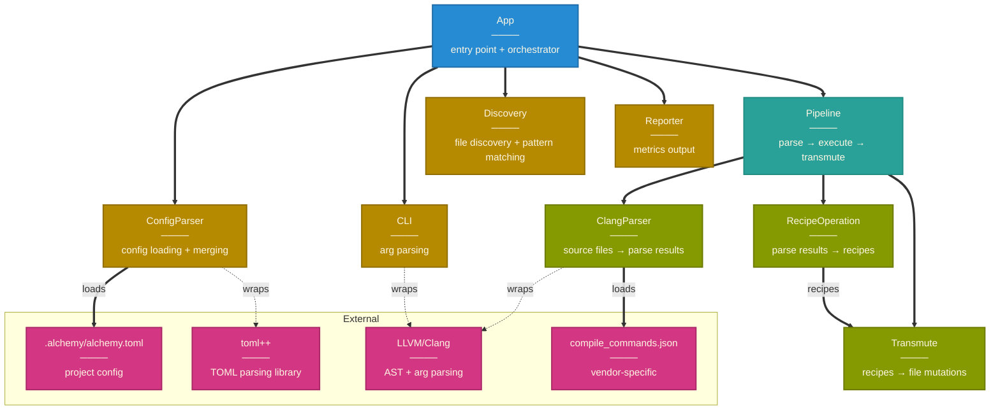
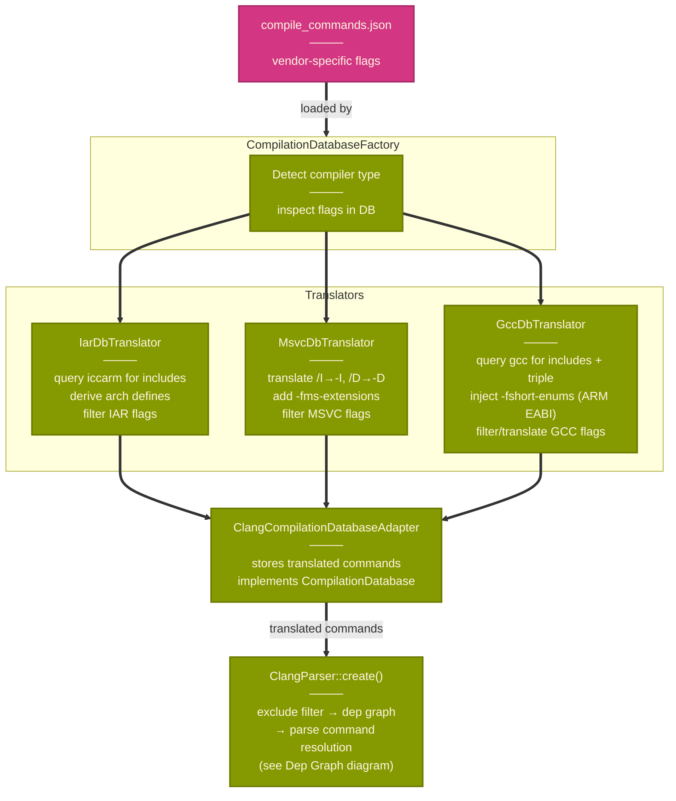
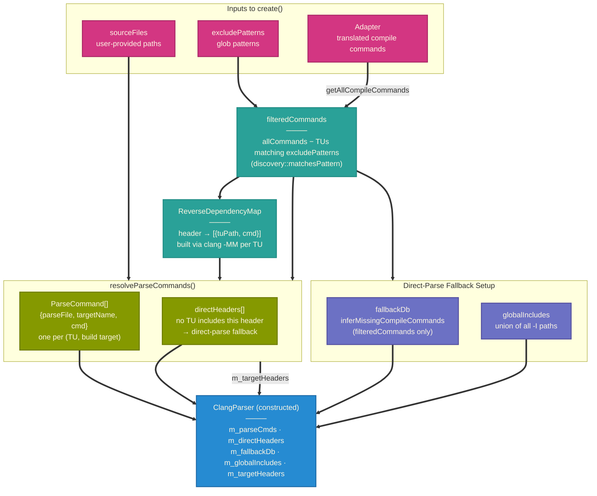

# Alchemy Component Architecture (v0.1.0-alpha)

**current state (v0.1.0-alpha)**:
- single feature: struct alignment refactoring (`--salign`)
- cross-compiler support: GCC, Clang, MSVC, IAR

## High-Level Module Boundaries

architecture boundaries, dependency direction, and layer separation

## Compiler Adapter Detail

zoomed-in view of the compiler detection and translation layer

---

## ClangParser - Dep Graph & Parse Command Resolution

data flow inside `ClangParser::create()`: from translated commands to the parse commands stored on the constructed parser

**Data Flow**:
1. **exclude filter** —> strips TUs whose source path matches any exclude pattern, prevents cross-target SDK include contamination from reaching dep graph or spec resolution
2. **dep graph** —> `clang -MM` per filtered TU builds `ReverseDepMap`: maps each header to the TUs that include it
3. **parse command resolution** —> for each user-provided file: source files map directly to their DB entry, headers map to every dep-graph TU that includes them (files absent from the dep graph go to `directHeaders`)
4. **fallback db** —> `inferMissingCompileCommands` wraps `filteredCommands` only (excluded TUs cannot contaminate inferred commands for direct-parse headers)

**why `m_targetHeaders`?** `ClangTool` runs on a full TU (e.g. `utils.c`) which pulls in many headers. `m_targetHeaders` contains only the user-requested absolute paths (`ClangStructParsingRule` uses it to discard struct definitions from non-target headers during AST traversal).

---

**Relationship Types:**
- **thick arrows (`==>`)** -> Runtime dependencies, data flow
- **dotted arrows (`-.->`)** —> Compile-time dependencies (interface implementation, wrapping)
- **regular arrows (`-->`)** —> Structural relationships

---

see [sequence-diagrams.md](sequence-diagrams.md) for runtime execution flows
