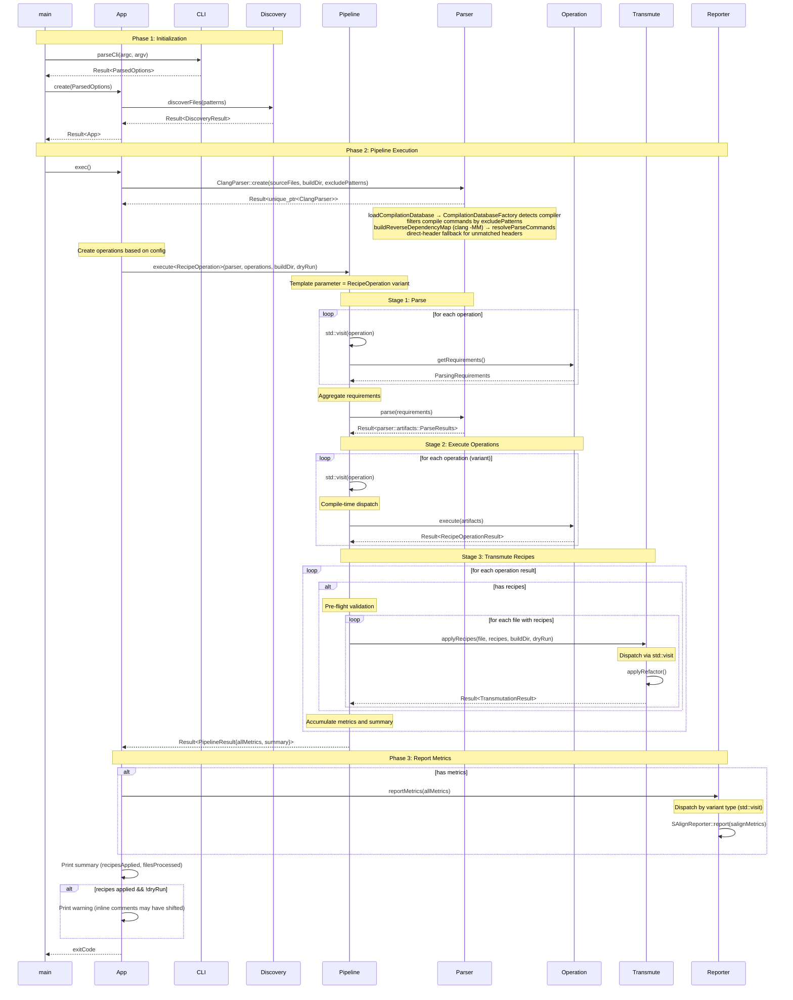
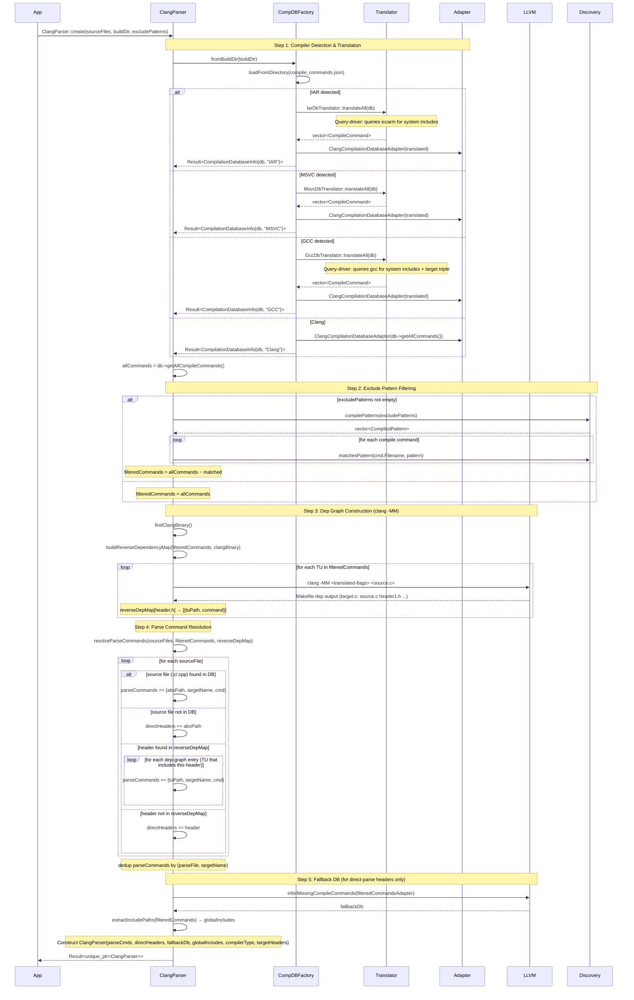
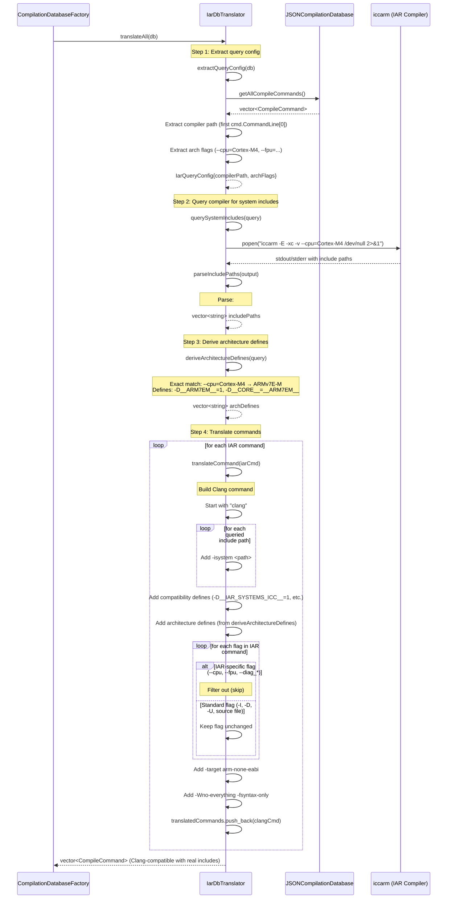
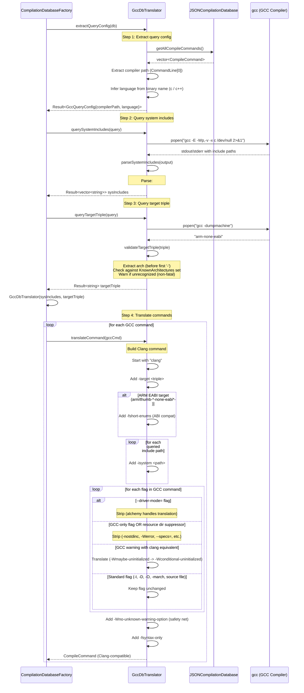
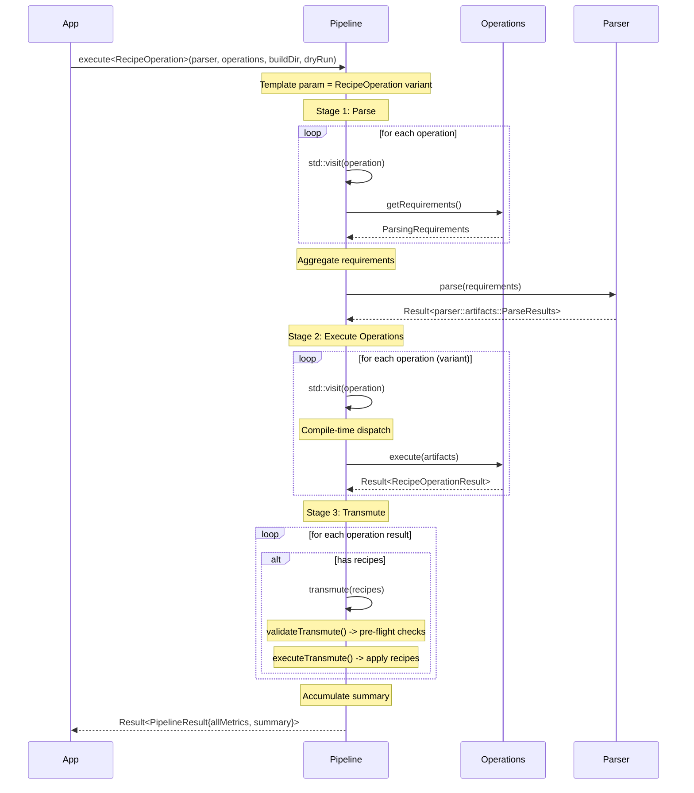
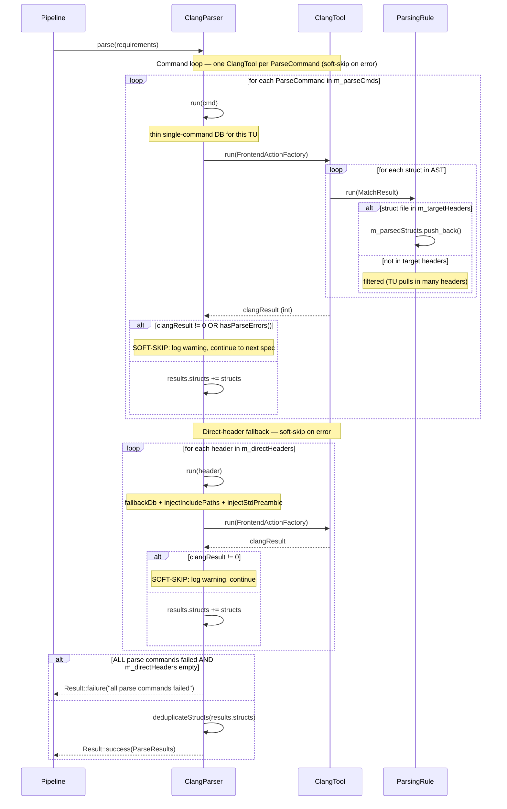
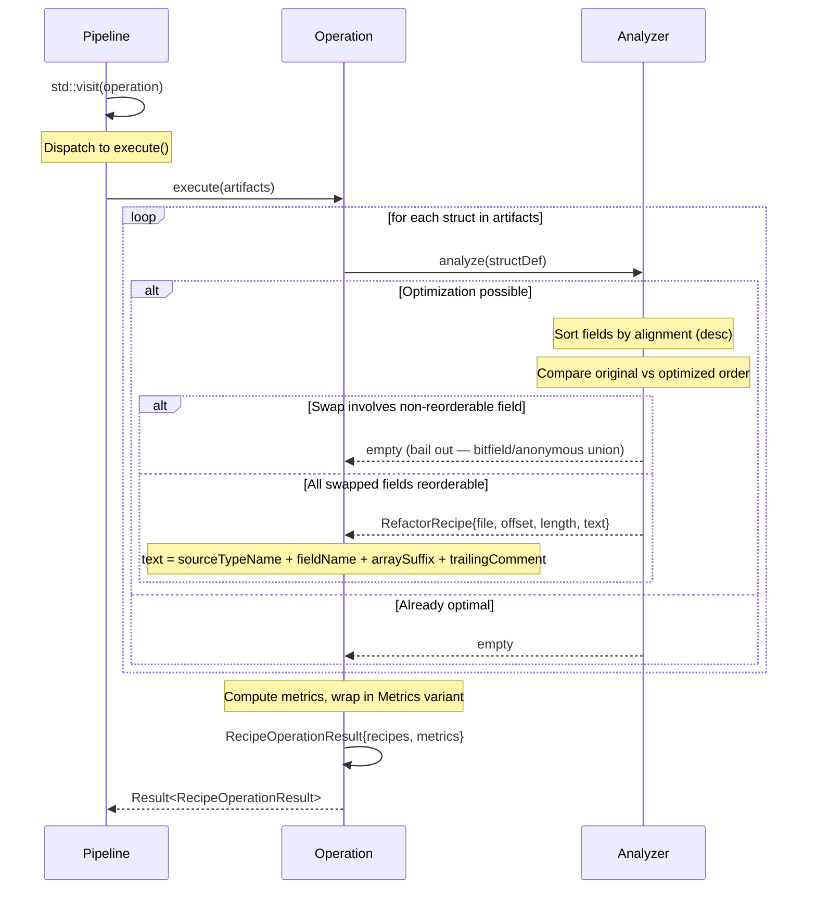
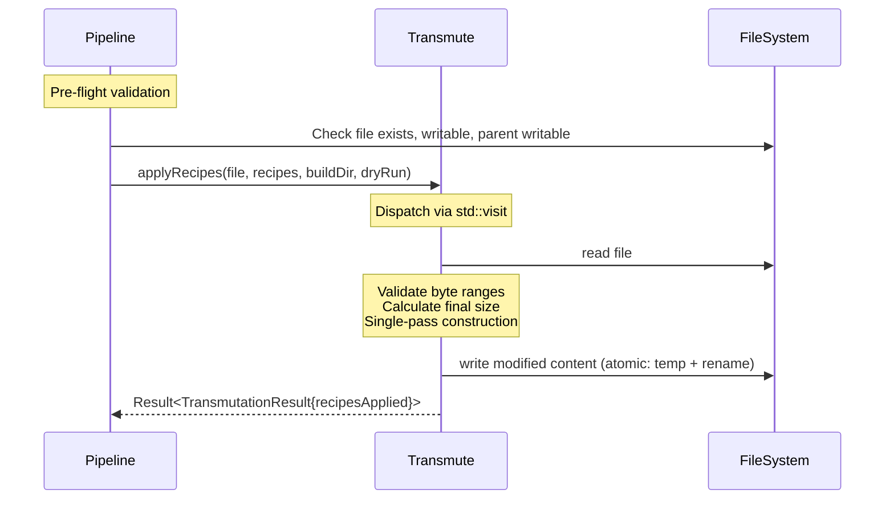
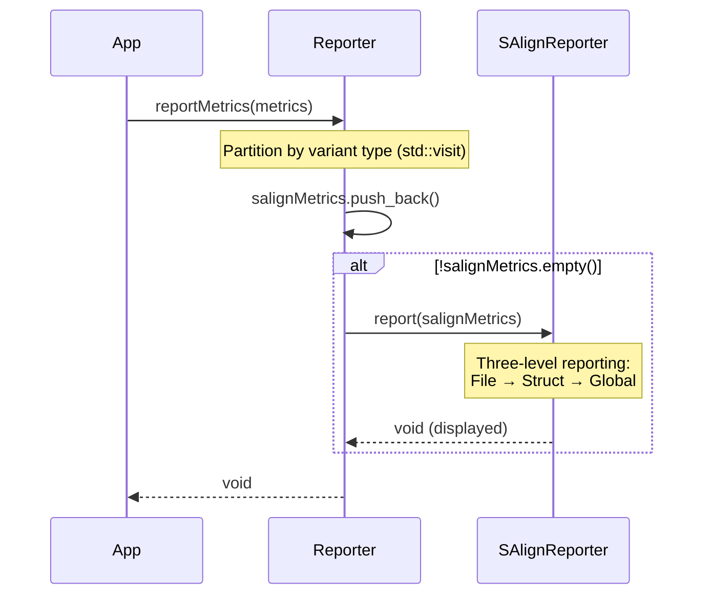
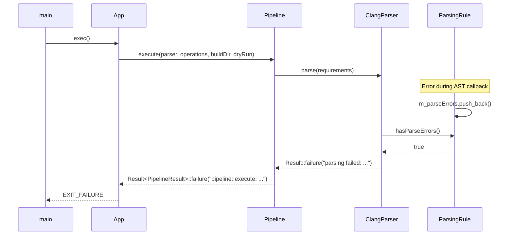

# Alchemy Sequence Diagrams (v0.1.0-alpha)

**Current state (v0.1.0-alpha)**:

high-level execution flows showing component interactions

---

## Complete Execution Flow

**Key Phases**:
1. **initialization** -> cli parsing, file discovery, AppConfig creation
2. **pipeline execution** -> parser creation, pipeline stages (parse → execute → transmute)
3. **report metrics** -> App reports metrics (I/O responsibility)

**Architecture Properties**:
- parser abstraction isolates LLVM from pipeline (language-agnostic interface)
- pipeline is stateless data transformation (no I/O)
- app handles I/O and reporting
- semantic layers: `parsing/` extracts data, `operation/` creates recipes, `transmute/` applies recipes

---

## Parser Creation & Lifecycle

**focus**: factory translates db, `create()` builds dep graph via `clang -MM`, resolves per-file parse commands

**Key Points**:
- `CompilationDatabaseFactory` detects compiler from flags in `compile_commands.json`
- uses stateless translators (GCC/IAR/MSVC) to convert commands to Clang-compatible format
- `create()` accepts `excludePatterns` — compile commands matching any pattern are stripped before dep graph work, preventing cross-target SDK include contamination
- dep graph built via `clang -MM` per filtered TU (produces `reverseDepMap: header → [{tuPath, command}]`)
- `resolveParseCommands()` maps each user-provided file to the TU(s) that include it, unmatched files go to `directHeaders` for direct-parse fallback
- `inferMissingCompileCommands` wraps `filteredCommands` only —> excluded TUs cannot contaminate the fallback DB
- `m_targetHeaders` stores user-requested absolute paths, `ClangStructParsingRule` uses it to filter AST results to only the requested files

**ParseCommand vs Direct Header**:
- **ParseCommand** (`m_parseCmds`): file is parsed via the TU that includes it (full include chain context) -> one command per `(TU, build target)` pair
- **direct header** (`m_directHeaders`): no TU in dep graph includes this file, parsed directly via `fallbackDb` with injected include paths and std-type preamble

---

## IAR Translator: Compiler Query Driven

**focus**: IAR translator queries actual compiler for system includes, derives architecture defines

**Key Points**:
- **compiler query**: executes actual IAR compiler to get system include paths (no hardcoded assumptions)
- **include path parsing**: parses compiler output for `#include <...>` search paths
- **architecture detection**: exact string matching on `--cpu` flag (M33 must not match M3)
  - supports: M0/M0+/M1 (ARMv6-M), M3 (ARMv7-M), M4/M4F/M7/M7F (ARMv7E-M), M23/M33/M33F (ARMv8-M)
- **compatibility defines**: `__intrinsic=`, `__packed=__attribute__((packed))`, etc.
- IAR uses GCC-compatible syntax for `-I`, `-D`, `-U` (no translation needed)
- returns `vector<CompileCommand>` with **real** include paths from actual compiler

---

## GCC Translator

**focus**: GCC translator queries compiler for system includes and target triple, filters GCC-specific flags, injects ABI-compatibility flags

**Key Points**:
- **compiler query**: Executes actual GCC compiler for system includes (`-E -Wp,-v`) and target triple (`-dumpmachine`)
- **non-fatal failures**: System include and target triple queries warn on failure but don't block translation
- **architecture validation**: Checks extracted arch against known set (arm, thumb, aarch64, x86_64, riscv32/64, avr, msp430), warns if unrecognized
- **ARM EABI `-fshort-enums`**: GCC implicitly enables packed enums for `arm-*-none-eabi*` / `thumb-*-none-eabi*` targets -> clang doesn't, so it's injected explicitly for `sizeof()` correctness
- **resource dir suppressors**: `-nostdinc`, `-nostdinc++`, `-nobuiltininc`, `-nostdlibinc` are stripped to prevent suppressing clang's resource directory (needed for target-correct `stdint.h`)
- **flag translation**: 6 GCC warning flags have clang equivalents (e.g., `-Wmaybe-uninitialized` → `-Wconditional-uninitialized`)
- **blocklist approach**: GCC-specific flags filtered by exact match set + prefix matching (`-fdump-*`, `-fipa-*`, `-Werror=*`)

---

## Pipeline: Parse → Execute → Transmute

**focus**: Template-based stateless pipeline stages with requirement-driven parsing

**Key Points**:
- **template-based**: `execute<RecipeOperationVariantT>()` -> generic over operation variant type
- production: `execute<RecipeOperation>(...)` -> uses real operations
- testing: `execute<TestRecipeOperation>(...)` -> uses mock operations
- single parse pass fulfills all operation requirements
- `parser::artifacts::ParseResults` passed by const reference to operations
- duck-typed interface: `std::visit` calls `getRequirements()`, `execute()` directly

---

## ClangParser - parse() Execution & Error Handling

**focus**: per-command ClangTool runs with soft-skip on failure (hard-fail only when nothing was analyzed)

**Key Points**:
- each `ParseCommand` gets its own `ClangTool` with a thin single-command DB (exactly the translated command for that TU)
- Clang AST callbacks have void return — errors are accumulated in `m_parseErrors` during traversal, checked after `ClangTool::run()` returns
- `m_targetHeaders` filters AST output to only the user-requested files -> TU-included-only headers are discarded
- **soft-skip**: a failing parse command (non-zero exit OR parse errors) emits a warning and continues — caused by cross-target SDK include contamination in the compile command
- **direct-header fallback** (`run(header)`): no TU in dep graph -> uses `fallbackDb` (inferred) + global include injection + std-type preamble injection
- **hard-fail** only in the degenerate case where every parse command failed AND there are no direct headers — nothing was analyzed at all
- `deduplicateStructs` removes duplicate `(sourceFile, structName)` pairs emitted when multiple parse commands parse the same shared header

---

## Recipe Generation

**focus**: Operations analyze artifacts, produce recipes wrapped in variants

**Key Points**:
- pipeline uses `std::visit` to invoke `execute()` on the variant operation type
- recipes auto-wrapped in `std::variant<RefactorRecipe>`
- metrics auto-wrapped in `std::variant<SAlignMetrics>`
- grouped by file for batch processing

---

## Transmute - Variant Dispatcher

**focus**: separate recipes by type, apply with type-specific logic

**Key Points**:
- pre-flight validation prevents partial modifications on error
- `std::visit` dispatches Recipe variant to type-specific handler
- refactorRecipes: validate byte ranges, calculate final size, single-pass construction, atomic write (temp + rename)
- single-pass construction (17% reduction vs string::replace)

---

## Metrics Reporter - Variant Dispatcher

**focus**: separate metrics by type, dispatch to type-specific reporters

**Key Points**:
- `std::visit` separates Metrics variant into concrete types
- each metric type dispatched to appropriate reporter
- reporting in App layer (I/O responsibility), not Pipeline
- app also reports transmutation summary from PipelineResult

---

## Error Propagation

**example**: error during parsing propagates to main with context

**Key Points**:
- result<T> propagates errors up call stack
- each layer adds contextual prefix
- user sees full error chain
- error strings moved with `std::move(result).error()` (no copies)

---
