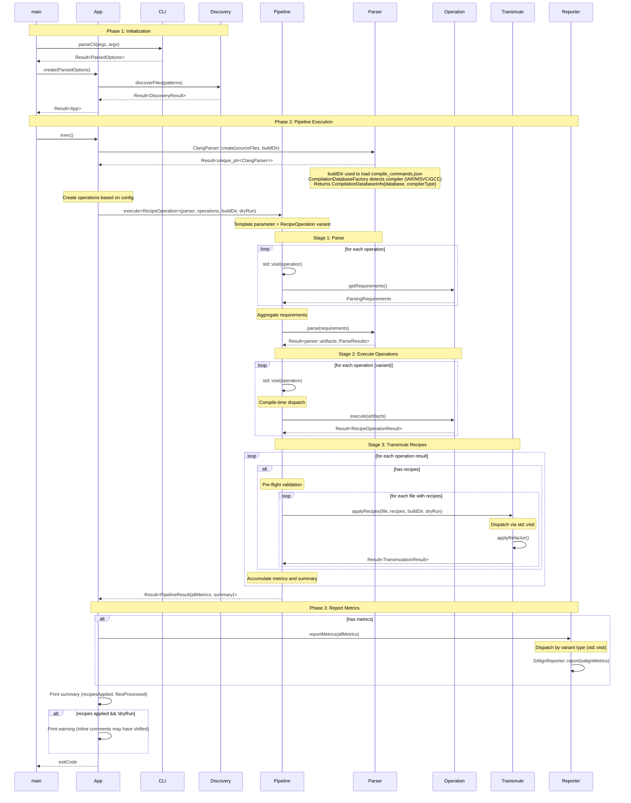
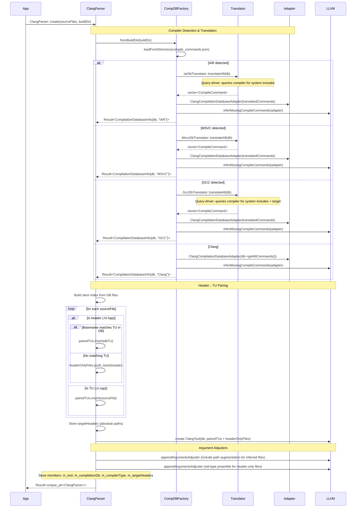
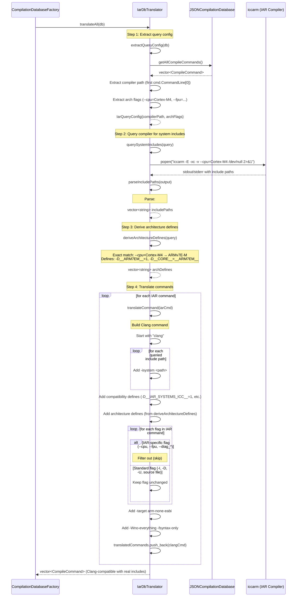
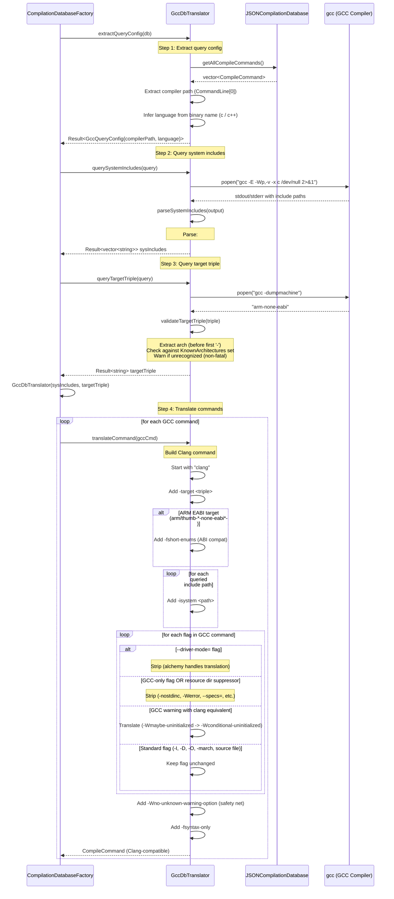
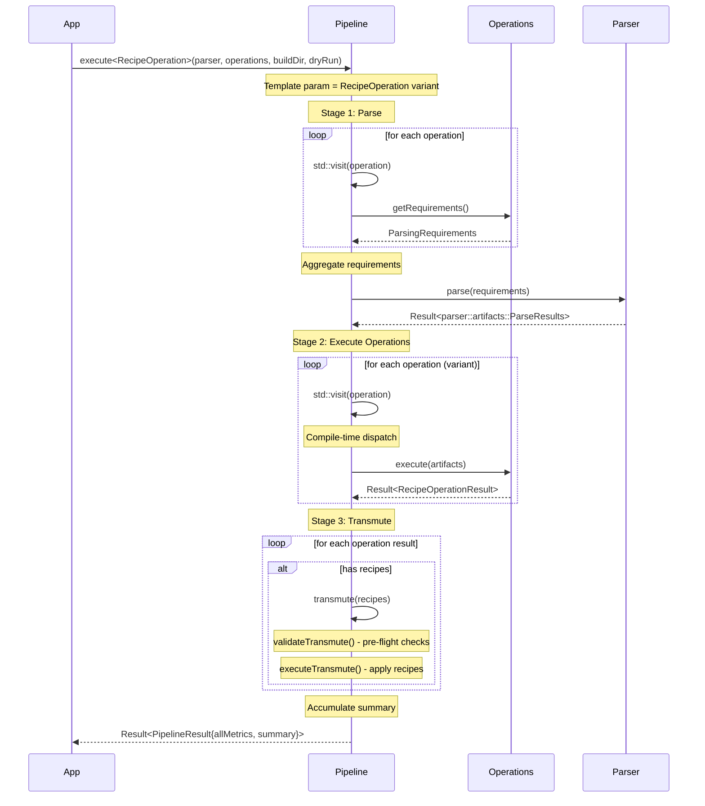
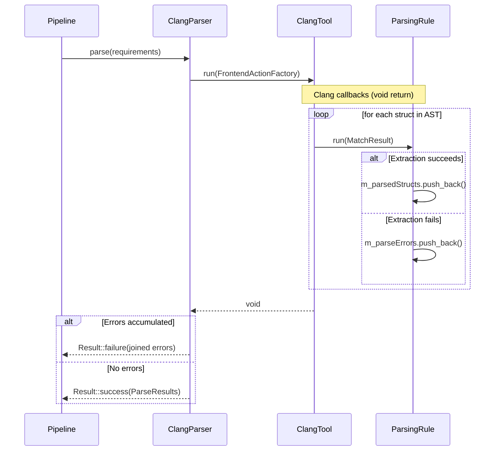
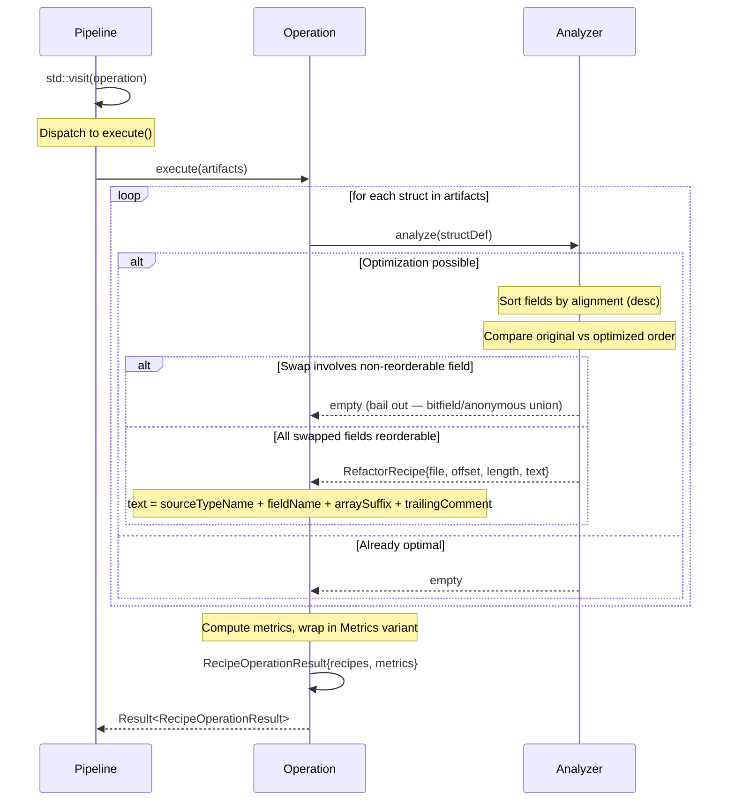
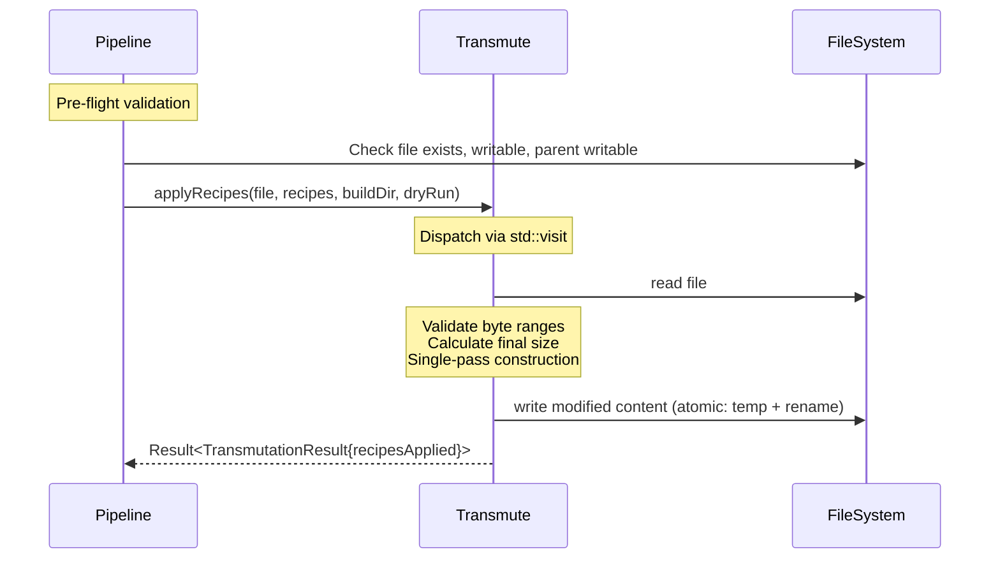
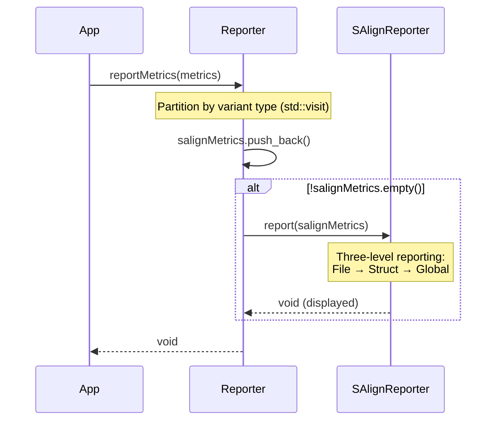
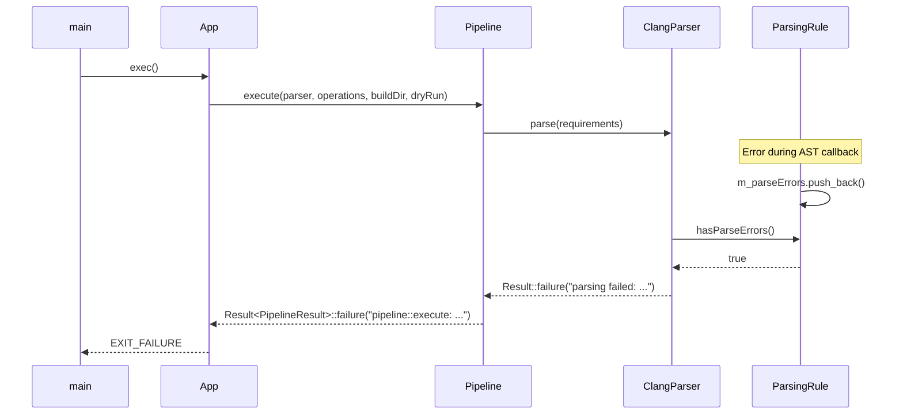

# Alchemy Sequence Diagrams (v0.1.0-alpha)

High-level execution flows showing component interactions.

**Current state (v0.1.0-alpha)**:
- Operations are plain classes with duck-typed interface: `getRequirements()`, `getName()`, `execute()`
- `std::visit` calls methods directly on variant alternatives (compile-time dispatch)
- IAR translator uses query-driver approach for system include paths
- Single feature: struct alignment refactoring (`--salign`)

---

## Complete Execution Flow

**Key Phases**:
1. **Initialization** - CLI parsing, file discovery, AppConfig creation
2. **Pipeline Execution** - Parser creation, pipeline stages (parse → execute → transmute)
3. **Report Metrics** - App reports metrics (I/O responsibility)

**Architecture Properties**:
- Parser abstraction isolates LLVM from pipeline (language-agnostic interface)
- Pipeline is stateless data transformation (no I/O)
- App handles I/O and reporting
- Semantic layers: `parsing/` extracts data, `operation/` creates recipes, `transmute/` applies recipes

---

## Parser Creation & Lifecycle

**Focus**: Factory pattern creates parser with compiler translator support, header→TU pairing

**Key Points**:
- `CompilationDatabaseFactory` detects compiler from flags in `compile_commands.json`
- Uses stateless translators (GCC/IAR/MSVC) to convert commands to Clang-compatible format
- Stores translated commands in `ClangCompilationDatabaseAdapter`
- Wraps adapter with `inferMissingCompileCommands()` for header-only file support

**Header→TU Pairing**:
- User-provided headers are paired with TUs from the DB by basename (e.g., `config.h` → `config.c`)
- Paired TUs are passed to ClangTool instead of bare headers — clang gets full include chain context
- Headers with no matching TU are parsed directly with inferred commands
- Source files already TUs (`.c`/`.cpp`) are parsed directly
- `m_targetHeaders` stores user-requested file paths for post-filtering in `parse()`

**Argument Adjusters**:
1. **Include path augmentation** — injects union of all `-I` paths for inferred (header-only) files
2. **Std-type preamble** — injects `-include stddef.h/stdint.h/stdbool.h` (resolved to full paths) for header-only files that may use std types without `#include`-ing them

---

## IAR Translator - Query-Driver Flow

**Focus**: IAR translator queries actual compiler for system includes, derives architecture defines

**Key Points**:
- **Query-driver**: Executes actual IAR compiler to get system include paths (no hardcoded assumptions)
- **Subprocess execution**: Uses `popen()` to run `iccarm -E -xc -v /dev/null`, captures verbose output
- **Include path parsing**: Parses compiler output for `#include <...>` search paths
- **Architecture detection**: Exact string matching on `--cpu` flag (M33 must not match M3)
  - Supports: M0/M0+/M1 (ARMv6-M), M3 (ARMv7-M), M4/M4F/M7/M7F (ARMv7E-M), M23/M33/M33F (ARMv8-M)
- **Compatibility defines**: `__intrinsic=`, `__packed=__attribute__((packed))`, etc.
- IAR uses GCC-compatible syntax for `-I`, `-D`, `-U` (no translation needed)
- Returns `vector<CompileCommand>` with **real** include paths from actual compiler

---

## GCC Translator - Query-Driver Flow

**Focus**: GCC translator queries compiler for system includes and target triple, filters GCC-specific flags, injects ABI-compatibility flags

**Key Points**:
- **Query-driver**: Executes actual GCC compiler for system includes (`-E -Wp,-v`) and target triple (`-dumpmachine`)
- **Non-fatal failures**: System include and target triple queries warn on failure but don't block translation
- **Architecture validation**: Checks extracted arch against known set (arm, thumb, aarch64, x86_64, riscv32/64, avr, msp430), warns if unrecognized
- **ARM EABI `-fshort-enums`**: GCC implicitly enables packed enums for `arm-*-none-eabi*` / `thumb-*-none-eabi*` targets; clang doesn't, so it's injected explicitly for `sizeof()` correctness
- **Resource dir suppressors**: `-nostdinc`, `-nostdinc++`, `-nobuiltininc`, `-nostdlibinc` are stripped to prevent suppressing clang's resource directory (needed for target-correct `stdint.h`)
- **Flag translation**: 6 GCC warning flags have clang equivalents (e.g., `-Wmaybe-uninitialized` → `-Wconditional-uninitialized`)
- **Blocklist approach**: GCC-specific flags filtered by exact match set + prefix matching (`-fdump-*`, `-fipa-*`, `-Werror=*`)

---

## Pipeline - Parse → Execute → Transmute (Template-Based)

**Focus**: Template-based stateless pipeline stages with requirement-driven parsing

**Key Points**:
- **Template-based**: `execute<RecipeOperationVariantT>()` - generic over operation variant type
- Production: `execute<RecipeOperation>(...)` - uses real operations
- Testing: `execute<TestRecipeOperation>(...)` - uses mock operations
- Single parse pass fulfills all operation requirements
- `parser::artifacts::ParseResults` passed by const reference to operations
- Duck-typed interface: `std::visit` calls `getRequirements()`, `execute()` directly

---

## ClangParser - Error Accumulation

**Focus**: Accumulate errors during AST callbacks (void return type)

**Key Points**:
- Clang callbacks have void return (cannot return errors)
- Errors stored in `m_parseErrors` vector during callbacks
- Checked after AST processing, converted to Result::failure()

---

## Recipe Generation

**Focus**: Operations analyze artifacts, produce recipes wrapped in variants

**Key Points**:
- Pipeline uses `std::visit` to invoke `execute()` on the variant operation type
- Recipes auto-wrapped in `std::variant<RefactorRecipe>`
- Metrics auto-wrapped in `std::variant<SAlignMetrics>`
- Grouped by file for batch processing

---

## Transmute - Variant Dispatcher

**Focus**: Separate recipes by type, apply with type-specific logic

**Key Points**:
- Pre-flight validation prevents partial modifications on error
- `std::visit` dispatches Recipe variant to type-specific handler
- RefactorRecipes: validate byte ranges, calculate final size, single-pass construction, atomic write (temp + rename)
- Single-pass construction (17% reduction vs string::replace)

---

## Metrics Reporter - Variant Dispatcher

**Focus**: Separate metrics by type, dispatch to type-specific reporters

**Key Points**:
- `std::visit` separates Metrics variant into concrete types
- Each metric type dispatched to appropriate reporter
- Reporting in App layer (I/O responsibility), not Pipeline
- App also reports transmutation summary from PipelineResult

---

## Error Propagation

**Example**: Error during parsing propagates to main with context

**Key Points**:
- Result<T> propagates errors up call stack
- Each layer adds contextual prefix
- User sees full error chain
- Error strings moved with `std::move(result).error()` (no copies)

---

## Performance Notes

- Pre-compiled glob patterns (once per pattern, not per file)
- Single parse pass with requirement aggregation
- Byte-offset precision (no line parsing overhead)
- Single-pass transmutation with pre-allocation
- Move semantics for `Result<T>` (eliminates error string copies)
- Primary bottleneck: ClangTool initialization and AST traversal

---
